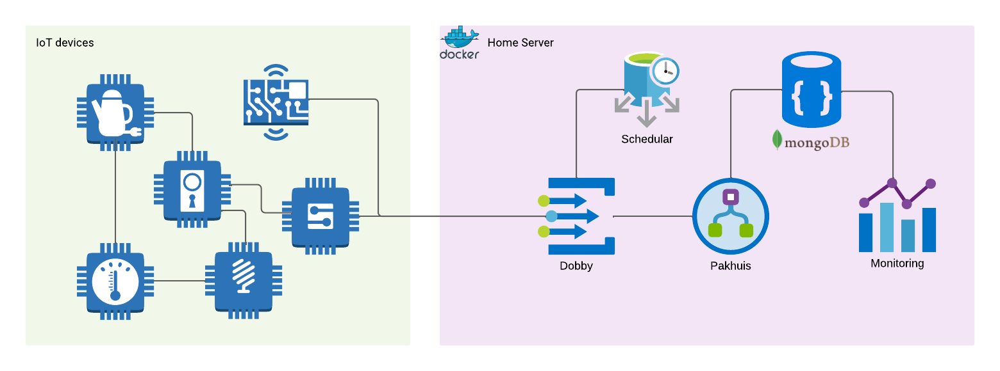

# Home-automation

My Home-automation project consists of several different components aka services with their own responsibility and divided in their own repositories.

|                             **Service**                            |    **Language**    |                                    **Description**                                   |
|:------------------------------------------------------------------:|:------------------:|:------------------------------------------------------------------------------------:|
| [WSN](https://github.com/DankersW/wsn)                             | C                  | Wireless battery powered applications for embedded devices based on the Zephyr RTOS  |
| [Dobby](https://github.com/DankersW/dobby)                         | Go                 | Gateway between the wireless notes and the rest of the system                        |
| [Framework](https://github.com/DankersW/home-automation-framework) | Python             | Scheduling scenes and poll devices                                                   |
| [Pakhuis](https://github.com/DankersW/pakhuis)                     | Go                 | DB driver translating Kafka streams to DB read/writes                                |
| [Frontend](https://github.com/DankersW/home-automation-frontend)   | JavaScript (React) | Frontend to visualize system data                                                    |
| [backend](https://github.com/DankersW/home-automation-backend)     | Go                 | RESt service                                                                         |
| [IPC](https://github.com/DankersW/home-automation-ipc)             | Protobuf           | Holds all interprocess communication definitions                                     |
| [SMD](https://github.com/DankersW/smart-home-devices)              | C++                | Some Arduino based applications                                                      |

&nbsp;



&nbsp;

## Getting started

This is very simple due to the power of Docker. The system runs on both ARM and x86, keep in mind that the ARM setup is used as a production setup on my RPI. In the future the PROD setup will be replaced by a Kubernetes setup. The DEV setup will keep using Docker-compose.

```sh
# x86
docker-compose -f docker-compose_dev-x86.yml up -d

# ARM used also as the production image
docker-compose -f docker-compose_prod-arm.yml up -d
```

## Wish-list

Listing of ideas and want-to-have items that I might implement in the future

* **Battery level:** monitor and report batter level of embedded devices
* **Mobile GUI:** make the frontend mobile friendly
* **Weather station:** measure outdoor weather conditions (sunlight, temp, humi, etc)
* **Public transportation departure times:** hook into Västtrafikes API
* **home-hub:** a small smart-mirror style GUI that shows an nice view with the weather, shopping list, calender, buss departures times, some device statuses, etc.
* **Blinds control:** control blinds of the house via a schedule
* **System diagnostics:** Run some system diagnostics from the frontend
* **Kubernetes:** Kubernetes cluster for all the containers
* **CD pipeline:** CD pipeline deploying the the kubernetes cluster
* **Who is home:** Keep track of who is home by checking the phones MAC-addresses from the router
* **Schedular:** Transform the home-automation-framework to become a schedular instead
* **Reachable from the internet:** Make some part reachable from the internet
