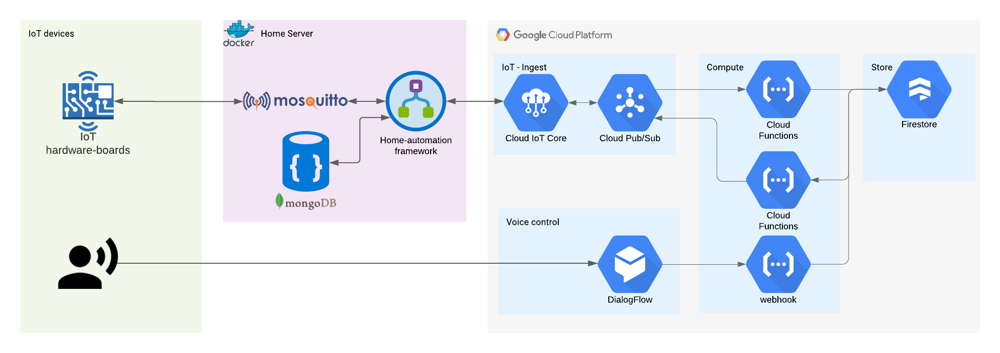
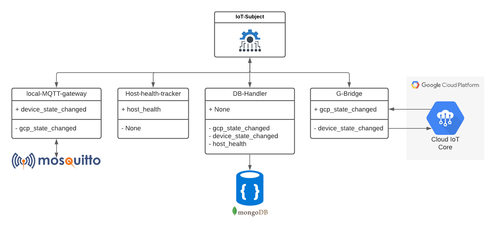
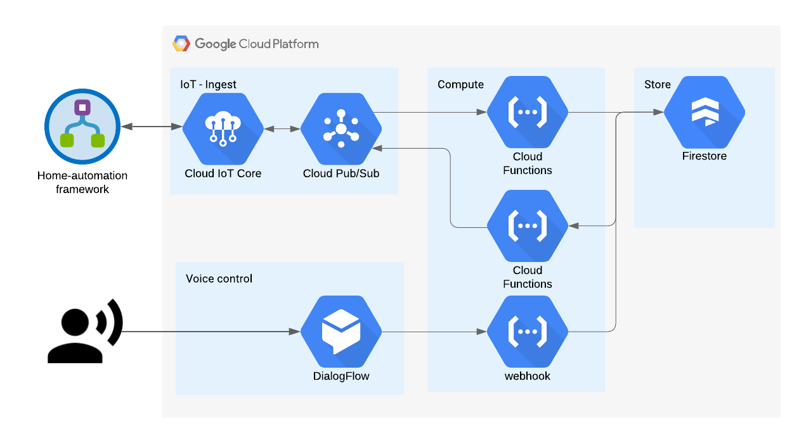

# Home-automation

My Home-automation project consists of several different components each with their own repo and responsibility.

**Run**

```sh
docker-compose -f docker-compose_prod-arm.yml up -d
```

|                                      | Status             | Start date | completion data |
|--------------------------------------|--------------------|------------|-----------------|
| Stage 1: Poc - Apartment temperature | Done :beers:  | 05-03-2021 | 25-03-2021      |
| Stage 2: Cleanup PoC                 | In-progress :gear: |            |                 |
| Stage 3: Plant health monitoring     | defined :dart:     |            |                 |

&nbsp;



## Home-automation-framework
Follows the Observer pattern and is primarily used as link between the smart-home-appliances, the cloud, and the visualization.

**Writen in:** Python


[Github repo](https://github.com/DankersW/home-automation-framework)

## IoT-monitoring

Front-end to visualize device status, host health monitoring, and iot-message tracing.

Using Angular as a front-end framework.

**Writen in:** Typescript


## Connected-home-cloud
Cloud part of the project. GCP is selected as the cloud provider. The main purpose of the cloud part is as an bridge my
Sonos eco-system and my IoT units. GCP enables me to talk to units using voice commands via Google Assistant which is
enabled on my Sonos network speakers.  

**Writen in:** GCP, Python, Node-js


[Github repo](https://github.com/DankersW/connected-home-cloud)

## Smart-home-devices

**Writen in:** C++ 

[Github repo](https://github.com/DankersW/smart-home-devices)
