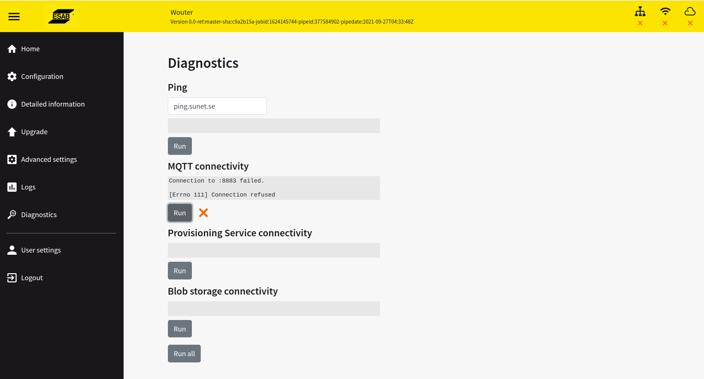

# Wish list

## Enable Debugging on IoT devices

Enable Debugging signals on the IoT devices via a MQTT command. The debug signals are send to a central place where
they can be displayed

## Send IOT device Battery level over MQTT

Send the battery level periodiaclly to the home server and make the server send out an email if
a device is close to running out of battery

## GUI (mobile)

A simple mobile gui that visualizes; state of appliances on a interactive map of the apartment

## Weather station

message inside and outside temp, sunlight inside and outside, predict sunset and rise

## Public transportation

Show the departure times of public transportation near me.

## Control the blinds

Control the blinds in the bedroom

## System diagnostics

Have a diagnostics helper that provides the option to diagronose parts of the system. Like MQTT, Internet connectivity, all the parts of the system etc. Have some loggo's ontop of the page to show the core things, and a diagnostics page that does something simular.

## Kuberneters cluster

Create a Kubernetes cluster using a couple of embedded computers.

## Hil system for WSN

Local runner at home that does some basic tests like power consumtion, and some basic communication of the WSN applications. The results need to be reported back to the CI-CD test and deploy pipeline

## CI-CD pipeline

CI-CD test and deploy pipeline, with some simple system tests, that deploys to the kuberneters cluster. The pipeline is triggered when a new tag is created in one of the repo's. Making this repo into a pipeline and documentation repo.

## Who is home

Fetch a list of currently connected MAC addresses from my Asus router, compare the MAC addresses with their assosiate names. Looking at this list, can tell you who is home, maybe also, who is home untill and from when.

## Reachable from the internet

Make some parts of the UI available from the internet

## Schedular

Scene schedular, Turn on certain lamps to a cosy color between the times of X-Y if one of the owners is home, based on the which mobile phone is in the appartment.
